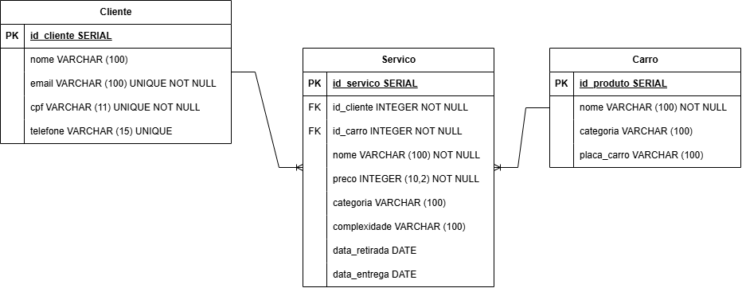

Osvaldo Motors
A criação de um sistema de software que possibilite realizar o gerenciamento dos carros e consertos de uma oficina mecânica.

Para cada cliente, releia as anotações da sua entrevista (Atividade 02) e identifique:

Entidades: Quais são as "coisas" que precisam ser salvas? (Ex: Cliente, Produto, Consulta).
-> O cliente, o serviço e o pedido devem ser salvos.

Atributos: Quais dados cada entidade tem? (Ex: Nome, CPF, Preço, Cor).
Cliente -> id, nome, cpf, email e telefone
Pedidos -> id_pedido, id_cliente e id_serviço
Produto -> id, nome e preco

Relacionamentos: Como elas se conectam? (Ex: 1 Paciente agenda N Consultas).
-> 1 Cliente faz N Pedido e Pedido contém 1 Serviço.

